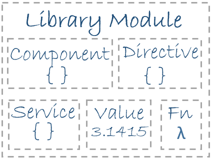

# Angular概览
**Angular Overview**

有关构建Angular应用的基本块。

Angular是一个以HTML及JavaScript或像是TypeScript这样的编译到JavaScript的语言，来构建客户端应用的框架（Angular is a framework for building client applications in HTML and either JavaScript or a language like TypeScript that compiles to JavaScript）。

该框架是由多个的库组成，一些是核心库，一些是可选库。

通过编写带有Angular化标记的HTML*模板*, 及管理这些模板的*组件*类，和在*服务*中加入应用逻辑，并将这些组件与服务装箱到*模块*中，就可以编写出Angular应用了（you write Angular applications by composing HTML *templates* with Angularized markup, writing *component* classes to manage those templates, adding application logic in *services*, and boxing components and services in *modules*）。

随后通过*引导根模块*，来启动应用（then you launch the app by *bootstrapping* the *root module*）。此时Angular便接管过来，在浏览器中呈现出应用内容，并通过你所提供的指令，对用户交互进行响应。

当然，实际上比上面所说的要复杂得多。在随后的本页中，你将了解到那些细节。现在请着重于大的图景。


该架构图标识出了8个构建Angular应用的主要块（the eight main building blocks of an Angular application）:

- [模块（Modules）](#modules)
- [组件（Components）](#components)
- [模板（Templates）](#templates)
- [元数据（Metadata）](#metadata)
- [数据绑定（Data Binding）](#data_binding)
- [指令（Directives）](#directives)
- [服务（Services）](#services)
- [依赖注入（Dependency Injection）](#dependency_injection)

请对这些构建块进行学习，你是在学习之路上的。

> 本页上所引用到的代码，在[现场示例](https://angular.io/resources/live-examples/architecture/ts/eplnkr.html)可以获取到。

## <a name="modules"></a>模块


Angular应用是模块化的，同时Angular有着自身的叫做*Angular modules*或*NgModules*的模块化系统（Angular apps are modular and Angular has its own modularity system called *Angular modules* or *NgModules*）。

*Angular modules* 是一个大的题目（a big deal）。本页对模块加以引入；而[Angular modules](https://angular.io/docs/ts/latest/guide/ngmodule.html)页面对Angular模块有深入介绍。

所有Angular应用都至少有着一个的Angular模块类，也就是[*根*模块（the *root* module）](https://angular.io/docs/ts/latest/guide/appmodule.html), 依惯例被命名为`AppModule`。

尽管在小型应用中*根模块*可能是唯一的模块，然而大多数应用都有着更多的*特性模块（feature modules）*，每个模块都是专注于某个应用方面、某个工作流程，或是密切相关的功能集的有着紧密联系的代码块（most apps have many *feature modules*, each a cohesive block of code dedicated to an application domain, a workflow, or a closely related set of capabilities, *译者注：* 这里有提到workflow，工作流程，那么我们就可以使用Angular构建客户端的工作流程应用了，这是非常重要的）。

某个Angular模块，不论其是*根的*或是*特性的*, 都是一个有着`@NgModule`装饰器的类（an Angular module, whether a *root* or *feature*, is a class with an `@NgModule` decorator）。

> 装饰器是一些对JavaScript类进行修改的函数。Angular有着许多的将元数据附加到类上的装饰器，这样做Angular就知道这些类的意义，以及这些类将如何运作（decorators are functions that modify JavaScript classes. Angular has many decorators that attach metadata to classes so that it knows what those classes mean and how they should work）。请在web上[了解更多有关装饰器](https://medium.com/google-developers/exploring-es7-decorators-76ecb65fb841#.x5c2ndtx0)的知识。

`NgModule`是一个取得单个的元数据对象的装饰器函数，该元数据对象的熟悉对被装饰的模块加以描述（`NgModule` is a decorator function that takes a single metadata object whose properties describe the module）。下面是一些最重要的属性：

- `declarations` -- 指明那些属于该模块的*视图类*。而Angular有着以下三种的视图类：[组件](#components)、[指令](#directives)与[管道](https://angular.io/docs/ts/latest/guide/pipes.html)。
- `exports` -- 这是`declarations`的子集，指明其它模块的组件[模板](#templates)中可见和可用的视图类。
- `imports` -- 指明一些其它模块，*本*模块中所声明的一些组件模板需要那些模块所导出的类（other modules whose exported classes are needed by component templates declared in *this* module）。
- `providers` -- 指明一些本模块贡献到全局服务集合的[服务](#services)创建器；这些服务在该app的所有部分成为可用的了（creators of [services](#services) that this module contributes to the global collection of services; they become accesible in all parts of the app）。
- `bootstrap` -- 指明主要应用视图，也叫做*根组件（the root component）*，该组件保存着所有其它的应用视图。注意只有*根模块*应设置此`bootstrap`属性（the main application view, called the *root component*, that hosts all other app views. Only the *root module* should set this `bootstrap` property）。

下面是一个简单的根模块：

`app/app.module.ts`

```typescript
import { NgModule } from '@angular/core'
import { BrowserModule } from '@angular/platform-browser'

@NgModule({
    imports: [ BrowserModule ],
    providers: [ Logger ],
    declarations: [ AppComponent ],
    exports: [ AppComponent ],
    bootstrap: [ AppComponent ]
})

export class AppModule {}
```

> 这里`AppComponent`的`export`仅是作为展示如何来导出；在本示例中并不是必要的。根模块没有任何理由去*导出*什么，因为其它组件并不需要*导入*根模块（a root module has no reason to *export* anything because other components don't need to *import* the root module, *译者注：* 对与根模块是这样，那么对于特性模块还是这样吗? 这个问题留待以后分析）。

通过*引导（bootstrapping）*应用的根模块，来启动某个应用。在开发过程中，很可能是在一个像下面这样的`main.ts`文件中，对`AppModule`加以引导。

`app/main.ts`

```typescript
import { platformBrowserDynamic } from '@angular/platform-browser-dynamic';

import { AppModule } from './app.module';

platformBrowserDynamic().bootstrapModule(AppModule);
```

### Angular模块与JavaScript模块的比较

Angular模块--一个用`@NgModule`装饰了的类--是Angular的一项基本特性（a fundamental feature）。

JavaScript也有着其自己的、用于管理JavaScript对象集合的模块系统（JavaScript also has its own module system for managing collections of JavaScript objects）。然而JavaScript的模块系统与Angular的模块系统是完全不同的，二者没有一点关系。

在JavaScript中，每个*文件*就是一个模块，且所有定义在那个文件中的对象，都属于那个模块。模块通过把定义的对象用`export`关键字标记出来，而将这些标记的对象声明为公共对象（the module declares some objects to be public by marking them with the `export` key word）。其它JavaScript对象使用*`import`语句*，来访问别的模块中的公共对象。

```typescript
import { NgModule }     from '@angular/core';
import { AppComponent } from './app.component';
```

```typescript
export class AppModule { }
```

> 请在web上了解更多有关JavaScript模块系统有关的知识。

Angular的模块系统和JavaScript模块系统，是两个不同的且互补的模块系统。请同时两套系统来编写apps。

### Angular的那些库（Angular libaries）



Angular是以一个JavaScript模块集合形式发布的（Angular ships as a collection of JavaScript modules）。可将这些JavaScript模块想作是一些库模块（library modules）。

每个Angular的库的名字，都以`@angular`前缀开头。

使用**npm**包管理器（the **npm** package manager）来安装这些Angular的库, 并使用JavaScript的`import`语句，来导入这些库的部分。

比如，像下面这样从`@angular/core`库，导入Angular的`Component`装饰器：

```typescript
import { Component } from '@angular/core'
```

而从Angular*库*中导入Angular的模块，也是使用JavaScript的导入语句：

```typescript
import { BrowserModule } from '@angular/platform-browser'
```

在上面的简单根模块中的示例中，该应用模块就需要那个`BrowserModule`中的原料（the application module needs material from within that `BrowserModule`）。而要访问到那个原料，就要像下面这样，将其加入到`@NgModule`的元数据`imports`中。

```typescript
imports: [ BrowserModule ]
```

这样做，就可以*一起*使用到Angular及JavaScript的模块系统了。

因为两种模块系统共用了通用的“imports”及“exports”列表，所以很容易搞混这两套系统。请坚持下去，这种困惑会随时间和经验的增长，而得到澄清（Hang in there. The confusion yields to clarity with time and experience）。

> 请从[Angular 模块](https://angular.io/docs/ts/latest/guide/ngmodule.html)页面了解更多有关此方面的内容。


## <a name="components"></a>组件


*组件*控制了名为*视图*的一片屏幕（a *component* controls a patch of screen called a *view*）。

比如，以下视图是被组件所控制的：

- 带有导航链接的应用根视图。
- 英雄清单视图。
- 英雄编辑器视图。

在类中定义出某个组件的应用逻辑--应用逻辑所做的，就是支持视图。通过属性与方法的API，该类与其视图进行交互（you define a component's application logic -- whate it does to support the view -- inside a class. The class interacts with the view through an API of properties and methods）。

比如，这个`HeroListComponent`有着一个返回从某个服务出请求到的英雄数组的`heroes`属性。同时`HeroListComponent`还有一个在用户从清单点击选择某名英雄时，对`selectedHero`属性进行设置的`selectHero()`方法。

`app/hero-list.component.ts(类的部分)`

```typescript
export class HeroListComponent implements OnInit {
    heroes: Hero[]
    selectedHero: Hero

    constructor (private service: HeroService) {}

    ngOnInit () {
        this.heroes = this.service.getHeroes ()
    }

    selectHero (hero: Hero) { this.selectedHero = hero }
}
```

Angular是随用户在应用中移动，而创建、更新与销毁组件的。通过像是上面所声明的`ngOnInit()`这样的可选[生命周期钩子（lifecycle hooks）](（you define a component's application logic -- whate it does to support the view -- inside a class）)，应用可在此生命周期中的各个时刻，执行一些动作（Angular creates, updates, and destroys components as the user moves through the application. Your app can take action at each moment in this lifecycle through optional lifecycle hooks, like `ngOnInit()` declared above）。

## 模板（Templates）


在定义组件视图时，是与其相伴的*模板*一同定义的。模板就是告诉Angular如何来渲染组件的一种HTML形式。除了少许的不同之外，模板看起来就像常规的HTML。下面就是一个`HeroListComponent`的模板：

`app/hero-list.component.html`

```html
<h2>Hero List</h2>
<p><i>Pick a hero from the list</i></p>
<ul>
  <li *ngFor="let hero of heroes" (click)="selectHero(hero)">
    {{hero.name}}
  </li>
</ul>
<hero-detail *ngIf="selectedHero" [hero]="selectedHero"></hero-detail>
```

虽然该模板使用了一些典型的像是`<h2>`及`<p>`这样的HTML元素，但其还有一些不同之处。比如`*ngFor`、`{{hero.name}}`、`(click)`、`[hero]`以及`<hero-detail>`这样的代码，使用到了Angular的[模板语法](https://angular.io/docs/ts/latest/guide/template-syntax.html)。

而`HeroDetailComponent`则是与上面所回顾到的`HeroListComponent`组件，有所*不同*的组件。`HeroDetailComponent`（这里没有显示其代码）展示的是某位用户从由`HeroListComponent`展示清单所选的特定英雄信息。那么`HeroDetailComponent`就是`HeroListComponent`组件的一个*子*组件。


请注意这里的`<hero-detail>`是如何在那些原生的HTML元素之间，舒适地躺在那里的。定制组件可与原生HTML在同一布局中无缝地混合（notice how `<hero-detail>` rests comfortably among native HTML elements. Custom components mix seamlessly with native HTML in the same layouts）。

### 关于元数据（Metadata）


元数据告诉Angular如何来对某个类进行处理（Metadata tells Angular how to process a class）。

请看看上面的`HeroListComponent`中的代码，可以看到该组件仅是一个类。不存在框架的影子，组建中没有一点的“Angular”（there is no evidence of a framework, no "Angular" in it at all）。

事实上，`HeroListComponent`真的就只是一个*类*。在*告诉Angular有关该类*之前，它还不是一个组件（it's not a component until you *tell Angular about it*）。

而要告诉Angular `HeroListComponent`是一个组件，就要将**元数据**附加到该类。

在TypeScript中，是通过使用*装饰器*来附加上元数据的。下面是`HeroListComponent`的一些元数据：

`app/hero-list.component.ts(元数据部分)`：

```typescript
@Component({
  moduleId: module.id,
  selector:    'hero-list',
  templateUrl: 'hero-list.component.html',
  providers:  [ HeroService ]
})
export class HeroListComponent implements OnInit {
/* . . . */
}
```

这里的`@Component`装饰器，将下面与其紧接着的类，标识为一个组件类（here is the `@Component` decorator, which identifies the class immediately below it as a component class）。

该`@Component`装饰器取得一个要求的、有着Angulary用于创建并展示组件及组件视图所需信息的配置对象（the `@Component` decorator takes a required configuration object with the information Angular needs to create and present the component and its view）。

一下是几个可能的`@Component`配置选项：

- `moduleId`: 对诸如`templateUrl`这样的模块相对URLs的基本地址（`module.id`）源进行设置（sets the source of the base address(`module.di`) for module-relative URLs such as the `templateUrl`）。
- `selector`: 指明告诉Angular在*父*HTML中找到`<hero-list>`标签的地方，创建并插入该组件的一个实例的CSS选择器（CSS selector that tells Angular to create and insert an instance of this component where it finds a `<hero-list>` tag in *parent* HTML）。比如，在某个app的HTML中包含了`<hero-list></hero-list>`时，Angular就将`HeroListComponent`视图的一个实例，在这些标记之间加以插入。
- `templateUrl`: 该组件的HTML模板的模块相对地址（module-relative address）, 如上面所示。
- `providers`: 指明组件所要求的那些服务的**依赖注入提供者**的数组（array of **dependency injection providers** for services that the component requires）。
