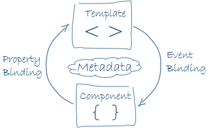

# Angular概览
**Angular Overview**

有关构建Angular应用的基本块。

Angular是一个以HTML及JavaScript或像是TypeScript这样的编译到JavaScript的语言，来构建客户端应用的框架（Angular is a framework for building client applications in HTML and either JavaScript or a language like TypeScript that compiles to JavaScript）。

该框架是由多个的库组成，一些是核心库，一些是可选库。

通过编写带有Angular化标记的HTML*模板*, 及管理这些模板的*组件*类，和在*服务*中加入应用逻辑，并将这些组件与服务装箱到*模块*中，就可以编写出Angular应用了（you write Angular applications by composing HTML *templates* with Angularized markup, writing *component* classes to manage those templates, adding application logic in *services*, and boxing components and services in *modules*）。

随后通过*引导根模块*，来启动应用（then you launch the app by *bootstrapping* the *root module*）。此时Angular便接管过来，在浏览器中呈现出应用内容，并通过你所提供的指令，对用户交互进行响应。

当然，实际上比上面所说的要复杂得多。在随后的本页中，你将了解到那些细节。现在请着重于大的图景。


该架构图标识出了8个构建Angular应用的主要块（the eight main building blocks of an Angular application）:

- [模块（Modules）](#modules)
- [组件（Components）](#components)
- [模板（Templates）](#templates)
- [元数据（Metadata）](#metadata)
- [数据绑定（Data Binding）](#data_binding)
- [指令（Directives）](#directives)
- [服务（Services）](#services)
- [依赖注入（Dependency Injection）](#dependency_injection)

请对这些构建块进行学习，你是在学习之路上的。

> 本页上所引用到的代码，在[现场示例](https://angular.io/resources/live-examples/architecture/ts/eplnkr.html)可以获取到。

## <a name="modules"></a>模块


Angular应用是模块化的，同时Angular有着自身的叫做*Angular modules*或*NgModules*的模块化系统（Angular apps are modular and Angular has its own modularity system called *Angular modules* or *NgModules*）。

*Angular modules* 是一个大的题目（a big deal）。本页对模块加以引入；而[Angular modules](https://angular.io/docs/ts/latest/guide/ngmodule.html)页面对Angular模块有深入介绍。

所有Angular应用都至少有着一个的Angular模块类，也就是[*根*模块（the *root* module）](https://angular.io/docs/ts/latest/guide/appmodule.html), 依惯例被命名为`AppModule`。

尽管在小型应用中*根模块*可能是唯一的模块，然而大多数应用都有着更多的*特性模块（feature modules）*，每个模块都是专注于某个应用方面、某个工作流程，或是密切相关的功能集的有着紧密联系的代码块（most apps have many *feature modules*, each a cohesive block of code dedicated to an application domain, a workflow, or a closely related set of capabilities, *译者注：* 这里有提到workflow，工作流程，那么我们就可以使用Angular构建客户端的工作流程应用了，这是非常重要的）。

某个Angular模块，不论其是*根的*或是*特性的*, 都是一个有着`@NgModule`装饰器的类（an Angular module, whether a *root* or *feature*, is a class with an `@NgModule` decorator）。

> 装饰器是一些对JavaScript类进行修改的函数。Angular有着许多的将元数据附加到类上的装饰器，这样做Angular就知道这些类的意义，以及这些类将如何运作（decorators are functions that modify JavaScript classes. Angular has many decorators that attach metadata to classes so that it knows what those classes mean and how they should work）。请在web上[了解更多有关装饰器](https://medium.com/google-developers/exploring-es7-decorators-76ecb65fb841#.x5c2ndtx0)的知识。

`NgModule`是一个取得单个的元数据对象的装饰器函数，该元数据对象的属性对被装饰的模块加以描述（`NgModule` is a decorator function that takes a single metadata object whose properties describe the module）。下面是一些最重要的属性：

- `declarations` -- 指明那些属于该模块的*视图类*。而Angular有着以下三种的视图类：[组件](#components)、[指令](#directives)与[管道](https://angular.io/docs/ts/latest/guide/pipes.html)。
- `exports` -- 这是`declarations`的子集，指明其它模块的组件[模板](#templates)中可见和可用的视图类。
- `imports` -- 指明一些其它模块，*本*模块中所声明的一些组件模板需要那些模块所导出的类（other modules whose exported classes are needed by component templates declared in *this* module）。
- `providers` -- 指明一些本模块贡献到全局服务集合的[服务](#services)创建器；这些服务在该app的所有部分成为可用的了（creators of [services](#services) that this module contributes to the global collection of services; they become accesible in all parts of the app）。
- `bootstrap` -- 指明主要应用视图，也叫做*根组件（the root component）*，该组件保存着所有其它应用视图。注意只有*根模块*应设置此`bootstrap`属性（the main application view, called the *root component*, that hosts all other app views. Only the *root module* should set this `bootstrap` property）。

下面是一个简单的根模块：

`app/app.module.ts`

```typescript
import { NgModule } from '@angular/core'
import { BrowserModule } from '@angular/platform-browser'

@NgModule({
    imports: [ BrowserModule ],
    providers: [ Logger ],
    declarations: [ AppComponent ],
    exports: [ AppComponent ],
    bootstrap: [ AppComponent ]
})

export class AppModule {}
```

> 这里`AppComponent`的`export`仅是作为展示如何来导出；在本示例中并不是必要的。根模块没有任何理由去*导出*什么，因为其它组件并不需要*导入*根模块（a root module has no reason to *export* anything because other components don't need to *import* the root module, *译者注：* 对于根模块是这样，那么对于特性模块还是这样吗? 这个问题留待以后分析）。

通过*引导（bootstrapping）*应用的根模块，来启动某个应用。在开发过程中，很可能是在一个像下面这样的`main.ts`文件中，对`AppModule`加以引导。

`app/main.ts`

```typescript
import { platformBrowserDynamic } from '@angular/platform-browser-dynamic';

import { AppModule } from './app.module';

platformBrowserDynamic().bootstrapModule(AppModule);
```

### Angular模块与JavaScript模块的比较

Angular模块--一个用`@NgModule`装饰了的类--是Angular的一项基本特性（a fundamental feature）。

JavaScript也有着其自己的、用于管理JavaScript对象集合的模块系统（JavaScript also has its own module system for managing collections of JavaScript objects）。然而JavaScript的模块系统与Angular的模块系统是完全不同的，二者没有一点关系。

在JavaScript中，每个*文件*就是一个模块，且所有定义在那个文件中的对象，都属于那个模块。模块通过把定义的对象用`export`关键字标记出来，而将这些标记的对象声明为公共对象（the module declares some objects to be public by marking them with the `export` key word）。其它JavaScript对象使用*`import`语句*，来访问别的模块中的公共对象。

```typescript
import { NgModule }     from '@angular/core';
import { AppComponent } from './app.component';
```

```typescript
export class AppModule { }
```

> 请在web上了解更多有关JavaScript模块系统有关的知识。

Angular的模块系统和JavaScript模块系统，是两个不同的且互补的模块系统。请同时两套系统来编写apps。

### Angular的那些库（Angular libaries）


Angular是以一个JavaScript模块集合形式发布的（Angular ships as a collection of JavaScript modules）。可将这些JavaScript模块想作是一些库模块（library modules）。

每个Angular的库的名字，都以`@angular`前缀开头。

使用**npm**包管理器（the **npm** package manager）来安装这些Angular的库, 并使用JavaScript的`import`语句，来导入这些库的部分。

比如，像下面这样从`@angular/core`库，导入Angular的`Component`装饰器：

```typescript
import { Component } from '@angular/core'
```

而从Angular*库*中导入Angular的模块，也是使用JavaScript的导入语句：

```typescript
import { BrowserModule } from '@angular/platform-browser'
```

在上面的简单根模块中的示例中，该应用模块就需要那个`BrowserModule`中的原料（the application module needs material from within that `BrowserModule`）。而要访问到那个原料，就要像下面这样，将其加入到`@NgModule`的元数据`imports`中。

```typescript
imports: [ BrowserModule ]
```

这样做，就可以*一起*使用到Angular及JavaScript的模块系统了。

因为两种模块系统共用了通用的“imports”及“exports”列表，所以很容易搞混这两套系统。请坚持下去，这种困惑会随时间和经验的增长，而得到澄清（Hang in there. The confusion yields to clarity with time and experience）。

> 请从[Angular 模块](https://angular.io/docs/ts/latest/guide/ngmodule.html)页面了解更多有关此方面的内容。


## <a name="components"></a>组件


*组件*控制了名为*视图*的一片屏幕（a *component* controls a patch of screen called a *view*）。

比如，以下视图是被组件所控制的：

- 带有导航链接的应用根视图。
- 英雄清单视图。
- 英雄编辑器视图。

在类中定义出某个组件的应用逻辑--应用逻辑所做的，就是支持视图。通过属性与方法的API，该类与其视图进行交互（you define a component's application logic -- whate it does to support the view -- inside a class. The class interacts with the view through an API of properties and methods）。

比如，这个`HeroListComponent`有着一个返回从某个服务处请求到的英雄数组的`heroes`属性。同时`HeroListComponent`还有一个在用户从清单点击选择某名英雄时，对`selectedHero`属性进行设置的`selectHero()`方法。

`app/hero-list.component.ts(类的部分)`

```typescript
export class HeroListComponent implements OnInit {
    heroes: Hero[]
    selectedHero: Hero

    constructor (private service: HeroService) {}

    ngOnInit () {
        this.heroes = this.service.getHeroes ()
    }

    selectHero (hero: Hero) { this.selectedHero = hero }
}
```

Angular是随用户在应用中移动，而创建、更新与销毁组件的。通过像是上面所声明的`ngOnInit()`这样的可选[生命周期钩子（lifecycle hooks）](（you define a component's application logic -- whate it does to support the view -- inside a class）)，应用可在此生命周期中的各个时刻，执行一些动作（Angular creates, updates, and destroys components as the user moves through the application. Your app can take action at each moment in this lifecycle through optional lifecycle hooks, like `ngOnInit()` declared above）。

## 模板（Templates）


在定义组件视图时，是与其相伴的*模板*一同定义的。模板就是告诉Angular如何来渲染组件的一种HTML形式。除了少许的不同之外，模板看起来就像常规的HTML。下面就是一个`HeroListComponent`的模板：

`app/hero-list.component.html`

```html
<h2>Hero List</h2>
<p><i>Pick a hero from the list</i></p>
<ul>
  <li *ngFor="let hero of heroes" (click)="selectHero(hero)">
    {{hero.name}}
  </li>
</ul>
<hero-detail *ngIf="selectedHero" [hero]="selectedHero"></hero-detail>
```

虽然该模板使用了一些典型的像是`<h2>`及`<p>`这样的HTML元素，但其还有一些不同之处。比如`*ngFor`、`{{hero.name}}`、`(click)`、`[hero]`以及`<hero-detail>`这样的代码，使用到了Angular的[模板语法](https://angular.io/docs/ts/latest/guide/template-syntax.html)。

而`HeroDetailComponent`则是与上面所回顾到的`HeroListComponent`组件，有所*不同*的组件。`HeroDetailComponent`（这里没有显示其代码）展示的是某位用户从由`HeroListComponent`展示清单所选的特定英雄信息。那么`HeroDetailComponent`就是`HeroListComponent`组件的一个*子*组件。


请注意这里的`<hero-detail>`是如何在那些原生的HTML元素之间，舒适地躺在那里的。定制组件可与原生HTML在同一布局中无缝地混合（notice how `<hero-detail>` rests comfortably among native HTML elements. Custom components mix seamlessly with native HTML in the same layouts）。

### 关于元数据（Metadata）


元数据告诉Angular如何来对某个类进行处理（Metadata tells Angular how to process a class）。

请看看上面的`HeroListComponent`中的代码，可以看到该组件仅是一个类。不存在框架的影子，组件中没有一点的“Angular”（there is no evidence of a framework, no "Angular" in it at all）。

事实上，`HeroListComponent`真的就只是一个*类*。在*告诉Angular有关该类*之前，它还不是一个组件（it's not a component until you *tell Angular about it*）。

而要告诉Angular `HeroListComponent`是一个组件，就要将**元数据**附加到该类。

在TypeScript中，是通过使用*装饰器*来附加上元数据的。下面是`HeroListComponent`的一些元数据：

`app/hero-list.component.ts(元数据部分)`：

```typescript
@Component({
  moduleId: module.id,
  selector:    'hero-list',
  templateUrl: 'hero-list.component.html',
  providers:  [ HeroService ]
})
export class HeroListComponent implements OnInit {
/* . . . */
}
```

这里的`@Component`装饰器，将下面与其紧接着的类，标识为一个组件类（here is the `@Component` decorator, which identifies the class immediately below it as a component class）。

该`@Component`装饰器取得一个要求的、有着Angulary用于创建并展示组件及组件视图所需信息的配置对象（the `@Component` decorator takes a required configuration object with the information Angular needs to create and present the component and its view）。

一下是几个可能的`@Component`配置选项：

- `moduleId`: 对诸如`templateUrl`这样的模块相对URLs的基本地址（`module.id`）源进行设置（sets the source of the base address(`module.di`) for module-relative URLs such as the `templateUrl`）。
- `selector`: 指明告诉Angular在*父*HTML中找到`<hero-list>`标签的地方，创建并插入该组件的一个实例的CSS选择器（CSS selector that tells Angular to create and insert an instance of this component where it finds a `<hero-list>` tag in *parent* HTML）。比如，在某个app的HTML中包含了`<hero-list></hero-list>`时，Angular就将`HeroListComponent`视图的一个实例，在这些标记之间加以插入。
- `templateUrl`: 该组件的HTML模板的模块相对地址（module-relative address）, 如上面所示。
- `providers`: 指明组件所要求的那些服务的**依赖注入提供者**的数组（array of **dependency injection providers** for services that the component requires）。这是告诉Angular该组件的构建器，需要`HeroService`才能获取到要显示的英雄清单的一种方式（this is one way to tell Angular that the component's constructor requires a `HeroService` so it can get the list of heroes to display, *译者注：*这里说是一种方式，那么还有别的方式，那就是在`AppModule`的`providers`中全局性地指明服务，随后就无需在组件`providers`中再指明，而可以直接导入使用了）。


`@Component`中的元数据，告诉Angular从哪里获取指定给该组件的那些构建块（the metadata in the `@Component` tells Angular where to get the major building blocks you specify for the component）。

模板、元数据及组件一起，对视图进行描述（the template, metadata, and component together describe a view）。

以同样方式来应用其它的一些元数据的装饰器，来引导Angular的行为（apply other metadata decorators in a similar fashion to guide Angular behavior）。而`@Injectable`、`@Input`及`@Output`则是几个较为常用的装饰器。

架构上告诉我们，必须要将元数据加入到代码，如此Angular才知道要做些什么（the architectural takeaway is that you must add metadata to your code so that Angular knows what to do）。

## 数据绑定（Data binding）

在无框架时，就要自己去负责将数据的值推入到HTML控件，并将用户响应转换成动作和数值的更新。亲历亲为地编写这样的推/拉逻辑，是单调乏味的、容易出错且读起来也是一场噩梦，那些老练的jQuery程序员可以证明这一切（without a framework, you would be responsible for pushing data values into the HTML controls and turning user reponses into actions and value updates. Writing such push/pull logic by hand is tedious, error-prone, and a nightmare to read as any experienced jQuery programmer can attest）。


Angular支持*数据绑定*特性，这种将模板的多个部分，与组件的多个部分结合起来的机制。通过将绑定标记添加到模板的HTML，来告诉Angular如何将两端连接起来（Angular supports **data binding**, a mechanism for coordinating parts of a template with parts of a component. Add binding markup to the template HTML to tell Angular how to connect both sides）。

如上面的图例所示，有着4种形式的数据绑定语法。每种形式都有一个方向 -- 到DOM的、从DOM的，或双向的。

上面的`HeroListComponent`示例模板，有着3种形式的数据绑定：

```html
<li>{{hero.name}}</li>
<hero-detail [hero]="selectedHero"></hero-detail>
<li (click)="selectHero(hero)"></li>
```

- `{{hero.name}}`这个[插值表达式（interpolation）](https://angular.io/docs/ts/latest/guide/displaying-data.html#interpolation)在`<li>`元素里头显示出组件的`hero.name`属性值。
- 而`[hero]`这个[属性绑定（property bindin）]()则将父组件`HeroListComponent`的`selectedHero`属性的值，传递给子组件`HeroDetailComponent`的`hero`属性。
- `(click)`这个[事件绑定（event binding）]()，则在用户点击某名影响名字时，调用组件的`selectHero`方法。

**双向数据绑定**是重要的第四种形式，其将属性与事件绑定，使用`ngModel`指令，结合在一个符号中（**Two-way data binding** is an important fourth form that combines property and event binding in a single notaion, using the `ngModel` directive）。下面就是一个`HeroDetailComponent`模板中的示例:

`app/hero-detail.component.html(ngModel部分)`：

```typescript
<input [(ngModel)]="hero.name" />
```

在双向绑定中，某个数据属性值从组件以属性绑定方式流入到输入框中。而用户的修改同样流回到组件，以事件绑定方式，将那个属性重置到最新的值（in two-way binding, a data property value flows to the input box from the component as with property binding. The user's changes also flow back to the component, resetting the property to the latest value, as with event binding）。

对于每个JavaScript的事件周期，Angular会对从应用组件树的根, 贯穿到所有子组件的*所有*数据绑定加以处理（Angular processes *all* data bindings once per JavaScript event cycle, from the root of the application component tree through all child components）。



在模板与其组件的通信中，数据绑定扮演了重要角色。

数据绑定对于父组件与子组件之间的通信，也是尤为重要的。

## 指令（Directives）


Angular的模板是*动态的（dynamic）*。在Angular渲染这些模板时，它会按照*指令*所给的指示，对DOM进行转换（Angular templates are *dynamic*. When Angular renders them, it transforms the DOM according to the instructions given by *directives*）。

指令是有着`@Directive`装饰器的类。那么组件就是一个*有着一个模板的指令*了；而`@Component`装饰器，实际上就是扩展了一些面向模板特性的`@Directive`装饰器了（a directive is a class with a `Directive` decorator. A component is a *directive-with-a-template*; a `@Component` decorator is actually a `@Directive` decorator extended with template-oriented features）。

> 尽管**组件从技术上讲是一个指令**，但因为组件是如此独特，且对于Angular应用的中心地位，所以此架构概览将组件从指令中独立开来。

又有着*其它*两种类型的指令：*结构*及*属性*指令（*structual* and *attribute* directives）。

这两种指令倾向于出现在某个元素标记内部，就如HTML元素的属性那样，少数时候作为名称出现，而更多的时候则是作为某个赋值或绑定的目标出现（they tend to appear within an element tag as attributes do, sometimes by name but more often as the target of an assignment or a binding）。

*结构*指令通过加入、移除及替换DOM中的元素，实现对布局的改变（**structual** directives alter layout by adding, removing, and replacing elements in DOM）。

下面的示例模板，使用了两个内建的结构指令：

`app/hero-list.component.html(结构方面)`：

```html
<li *ngFor="let hero of heroes"></li>
<hero-detail *ngIf="selectedHero"></hero-detail>
```

- `*ngFor`告诉Angular对`heroes`清单中的每名英雄，复刻出一个`<li>`。
- `*ngIf`仅在存在一名选定英雄时，包含`HeroDetail`子组件

**属性**指令则是对一个既有元素的外观或行为，进行修改（**Attribute** directives alter the appearance or behavior of an existing element）。在模板中，它们与常规HTML属性看起来无异，因此有着属性指令的叫法。

而实现双向数据绑定的`ngModel`指令，就是属性指令的示例。`ngModel`通过设置某个既有元素（通常是一个`<input>`）的显示值属性，及对变化事件的响应，而实现对既有元素行为进行修改。

`app/hero-detail.component.html(ngModel部分)`

```html
<input [(ngModel)]="hero.name" \>
```

Angular还有着少数几个其它的要么对布局结构加以修改（比如`ngSwitch`）、要么对DOM元素及组件的一些方面进行修改（比如`ngStyle`及`ngClass`）的指令。

当然，还可以编写自己的指令。诸如`HeroListComponent`这样的组件，就是定制指令的一种类型（components such as `HeroListComponent` are one kind of custom directive）。

## 服务（Services）

服务是一个包含了任何应用所需的值、函数，或特性的一个大的类别（a broad category encompassing any value, function, or feature that your application needs）。

尽管任何东西都可以是一个服务。但服务通常是有着窄的、良好定义目的的一个类。其应做一些特定的事情，并能完成得很好。

一些服务示例如下：

- 日志服务（logging service）
- 数据服务（data service）
- 消息总线（message bus）
- 税额计算器（tax calculator）
- 应用配置（application configuration）

对于服务来讲，*Angular*并没有什么特别的地方。Angular没有服务的定义。没有服务的基类，也没有注册服务的地方（there is nothing specifically *Angular* about services. Angular has no definition of a service. There is no service base class, and no place to register a service）。

但服务对于任何Angular应用来说，都是基本的。组件就是服务的大头消费者（yet services are fundamental to any Angular application. Components are big consumers of services）。

下面是一个记录到浏览器控制台的服务类的示例：

`app/logger.service.ts(作为类)`：

```typescript
export class Logger {
    log(msg: any) { console.log(msg) }
    erro(msg: any) { console.error(msg) }
    warn(msg: any) { console.warn(msg) }
}
```

下面的`HeroService`获取英雄并将他们以一个解决的Promise加以返回。该`HeroService`依赖于`Logger`服务及另一个处理服务器通信繁重事务的`BackendService`（the `HeroService` depends on the `Logger` service and another `BackendService` that handles the server communication grunt work）。

`app/hero.service.ts(类的部分)`：

```typescript
export class HeroService {
    private heroes: Hero[] = []

    constructor (
        private backend: BackendService,
        private logger: Logger
    ){}

    getHeroes () {
        this.backend.getAll(Hero)
            .then(
                (heroes: Hero[]) => {
                    this.logger.log(`Fetched ${heroes.length} heroes.`)
                    this.heroes.push(...heroes)
                }
            )
        return this.heroes
    }
}
```

服务无处不在。

组件类应是精益的（component classes should be lean）。它们不从服务器获取数据、验证用户输入，或是直接记录到控制台。它们将此类任务托付给服务。

组件的工作，就是保证用户体验，而不应干得更多。组件在视图（为模板所渲染）和应用逻辑（其通常包含一些*模型*概念）之间进行协调。良好组件展示出用于数据绑定的属性与方法。将所有不那么简单的事务，都托付给服务（it mediates between the view(rendered by the template) and the application logic(which often includes some notion of *model*). A good component presents properties and methods for data binding. It delegates everything nontrivial to services）。

不过Angular并不*强制*这些原则。就算你写了3000行的琐碎组件，它也不会抱怨什么（Angular doesn't *enforce* these principles. It won't complain if you write a "kichen sink" component with 3000 lines）。

但Angular以易于将应用逻辑分解到服务中去，并通过*依赖注入*而领导这些服务对组件可用的方式，来帮助你*依循*这些原则。

## 依赖注入（dependency injection）


*依赖注入*是一种以其所要求的完整依赖，来提供到某个类的新实例的方式（*dependency injection* is a way to supply a new instance of a class with the fully-formed dependencies it requires）。大多数的依赖都是服务。Angular使用依赖注入，来为新组件提供它们所需的服务。

Angular可通过查看组件的（组件的）构建器参数，就可以说出组件所需哪个服务（Angular can tell which services a component needs by looking at the types of its constructor parameters）。比如，`HeroListComponent`组件的构建器需要一个`HeroService`：

`app/hero-list.component.ts(构建器部分)`

```typescript
constructor ( private service: HeroService ) {}
```

**译者注：** 可以看出，Angular中构建器，constructor一词, 是一个专用词，指的是组件涉及依赖注入时，从导入的服务类构建一个服务实例的方法。

在Angular建立一个组件时，它首先就该组件所要求的服务，对某个**注入器**进行询问。

**译者注：**可以看出，Angular的依赖注入，是结合到元数据中的`providers`项，及构建器完成的，而这里所指的注入器，则目前不知为何物。

注入器维护着其先前所建立的服务实例的容器（an injector maintains a container of service instances that it has previously created）。如某个请求的服务实例不再容器中，注入器就制造出一个来，并在将该服务返回给Angular之前，将其加入到容器中。在所有请求的服务都已被解决并返回后，Angular就可以这些服务作为参数，对组件的构建器进行调用。这就是*依赖注入*。

`HeroService`的注入过程，看起来有点像下面这个图示：


而加入注入器没有一个`HeroService`，那么它怎么知道怎样来制作一个呢？

简言之，你先前就必须已使用注入器，注册了`HeroService`的一个**提供者**（in brief, you must have previously registered a **provider** of the `HeroService` with the injector）。而提供者是某种能建立或返回一个服务的东西，通常就是该服务类本身。

可在模块或组件中，注册一些提供者。

一般而言，请将提供者加入到[根模块]()，如此某个服务的相同实例，就在应用的所有地方可用了。

`app/app.module.ts(模块的提供者部分)`：

```typescript
providers: [
    BackendService,
    HeroService,
    Logger
]
```

另外就是在组件级别`@Component`元数据的`providers`属性中注册：

`app/hero-list.component.ts(组件的提供者部分)`：

```typescript
@Component({
    moduleId: module.id,
    selector: 'hero-list',
    templateUrl: 'hero-list.component.html',
    providers: [ HeroService ]
})
```

在组件级别的注册，意味着那个组件的每个新实例，都将得到一个该服务的新实例。

要记住以下的有关依赖注入的几点：

- 依赖注入是接入到Angular框架中的，同时在所有地方都有用到（dependency injection is wired into the Angular framework and used everywhere）。
+ *注入器*是主要机制（the *injector* is the main mechanism）。
    - 注入器维护着其所建立的服务实例的*容器*（an injector maintains a *container* of service instances that it created）。
    - 注入器可从某个*提供者*，建立某个新的服务实例。
- *提供者*是建立某个服务的配方（a *provider* is a recipe for creating a service）。
- 使用注入器来注册*提供者*（register *providers* with injectors）。

## 总结（wrap up）

我们已经学习了Angular应用的8个主要构建块的基本知识：

- 模块
- 组件
- 模板
- 元数据
- 数据绑定
- 指令
- 服务
- 依赖注入

这些是Angular应用其它方面的基础，同时对于开始编写Angular应用已绰绰有余了。但这并未包含你需要知道的全部内容。

下面是一个其它重要的Angular特性及服务的简要的、以字母顺序排序的清单。本文档涵盖了其中的大多数（其它也将很快写出来）。

- [动画（**Animations**）](https://angular.io/docs/ts/latest/guide/animations.html)：使用Angular的动画库，在无需深入的动画技巧或CSS的情况下，令到组件行为动起来（Animate component behavior without deep knowledge of animation techniques or CSS with Angular's animation library）。
- 变化探测（**change detection**）：变化探测文档将涉及Angular如何判断某个组件的属性值已发生改变、何时去更新屏幕，以及如何使用区域（**zones**）来拦截异步活动并运行其变化探测策略（the change detection documentation will cover how Angular decides that a component property value has changed, when to update the screen, and how it uses **zones** to intercept asynchronous activity and run its change detection strategies）。
- 事件（**events**）：事件文档将涉及怎样在一些机制下，使用组件与服务来提升事件，以实现事件的发布与订阅（the events documentation will cover how to use components and services to raise events with mechanisms for publishing and subscribing to events）。
- [表单（**forms**）](https://angular.io/docs/ts/latest/guide/forms.html)：表单库通过基于HTML的验证与规则检查，而支持复杂的数据输入场景（support complex data entry scenarios with HTML-based validation and dirty checking）。
- [HTTP](https://angular.io/docs/ts/latest/guide/server-communication.html)：通过HTTP客户端，与服务器进行通信，以获取数据、保存数据，及发起服务端的动作（communicate with a server to get data, save data, and invoke server-side actions with an HTTP client）。
- [生命周期钩子](https://angular.io/docs/ts/latest/guide/lifecycle-hooks.html)：通过部署一些生命周期钩子接口，而对从组件的建立到销毁的生命周期中的一些关键点加以利用（tap into key moments in the lifecycle of a component, from its creation to its destrucion, by implementing the lifecycle hook interfaces）。
- [管道](https://angular.io/docs/ts/latest/guide/pipes.html)：在模板中使用管道，通过为显示目的而将一些值进行变形处理，来改进用户体验。比如下面的这个`currency`管道表达式：`price | currency: 'USD': true`。其将一个`42.33`的价格，显示为`$42.33`。
- [路由器](https://angular.io/docs/ts/latest/guide/router.html)：在客户端应用内部实现页面到页面的导航，且绝不会脱离浏览器。
- [测试](https://angular.io/docs/ts/latest/guide/testing.html)：在应用的一些部件上允许单元测试，因为这些单元测试通过*Angular测试平台*，与Angular框架有着交互（run unit tests on your application parts as they interact with the Angular framework using the *Angular Testing Platform*）。
