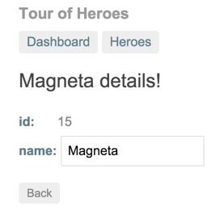
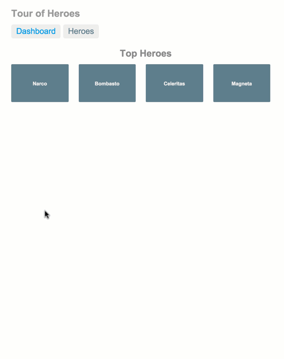

# 教程：英雄之旅

此英雄之旅教程，将引导你走过以TypeScript, 建立一个Angular应用的各个步骤。

此教程的大目标，就是构建一个应用，来帮助人力资源机构，管理其签约英雄。就算英雄也需要找到工作呀。

在本教程中，当然只会取得一点点进步。但这里所构建的应用，将包含在一个成熟的、数据驱动的应用中，所期望能找到的众多特性：英雄列表的获取及现实、编辑所选定英雄的信息，以及在英雄数据的不同视图之间的导航。

英雄之旅涵盖了Angular的一些核心基础知识点。
+ 这里将用到一些内建的指令（built-in directives），来显示或隐藏页面元素，以及英雄数据清单的显示。
+ 将建立一个组件来现实英雄详细信息，并建立另一个组件，来显示一个英雄的数组（an array of heroes）。
+ 对于那些只读数据（read-only data）, 这里将使用单项数据绑定（one-way data binding）。
+ 将加入可编辑字段，来对带有双向数据绑定的某个模型加以更新（add editable fields to update a model with two-way data binding）。
+ 这里将把一些组件方法，绑定到注入按键及鼠标点击这样的用户事件（bind component methods to user events like key strokes and clicks）。
+ 将学习从某个主清单中选择一个英雄，并在详情视图中加以编辑（learn to select a hero from a master list and edit that hero in the details view）。
+ 将使用管道对数据进行格式化操作（format data with pipes）。将建立一个共享服务，来对这些英雄加以集合（create a shared service to assemble our heroes）。
+ 还将使用路由在不同视图及其组件之间进行导航（use routing to navigate among different views and their components）。

这里将学习到足够的Angular核心知识，以开始Angular应用的编写，并获取到可令Angular实现我们想要的功能的信心。这里将涵盖到很多入门级别的基础知识，涉及到这些知识的时候，文档会提供足够多到其它章节的链接，以便深入了解这些知识点。

请运行[现场示例](https://angular.io/resources/live-examples/toh-6/ts/eplnkr.html)。

## 最终效果

这里有一个本教程中我们将要经历的视觉概念，以"Dashboard"视图及最为英勇的英雄开始：


在看板的上面部分，是两个链接（"Dashboard"及"Heroes"）。可通过对它们进行点击，来在看板与多英雄视图之间导航。

此外，在点击名为“Magneta”的看板英雄之后，路由器（the router）将带着我们前往到该英雄的“Hero Details”的视图，那里可修改英雄的名字。



此时点击“Back”按钮，将会把我们带回到“Dashboard”。顶部的链接则可分别将我们带至两个主要视图（the main views）。在点击“Heroes”时，该应用将前往“Heroes”主清单视图（the "Heroes" master list view）。


在点击不同英雄时，主清单下的那个只读的小型详情（the readonly mini-detail），将反应所选条目。

在点击只读的小型详情中的“View Details”按钮时，就会进入到所选英雄的可编辑详情组件。


下面是运作中的应用：



## 紧接着的下一步

我们将一起来构建这个英雄之旅的应用，一步一步地。在每一步都将使用一项在无数应用中都要遇到的特性需求，以激发大家的学习。万事万物都有其存在的因果。

在路途中，我们也将遇到许多Angular的核心基础知识点。

## 英雄编辑器

将要建立一个简单的英雄编辑器。

### 建立本地开发环境

真实的应用开发，是在自己机器上一个本地开发环境中进行的。

请依循[建立环境](https://angular.io/docs/ts/latest/guide/setup.html)的操作说明，来建立一个名为`angular-tour-of-heroes`的新项目，在建立之后，文件结构看起来应像下面这样：


在完成这个第一小节后，应用会像这个[现场示例](https://angular.io/resources/live-examples/toh-1/ts/eplnkr.html)一样运行。

### 让app保持转换（transpiling）及运行

> *译者注：* 这里的transpiling指的是从TypeScript到JavaScript的转换，TypeScript的编译器（TypeScript Compiler, tsc）将TypeScript代码转换成JavaScript代码，过程中会对其进行优化。transpiling与compiling（编译）有所不同，编译是将源代码编译链接为二进制形式，transpiling则不同。

这里要启动TypeScript编译器，让其监视TypeScript代码变化，并启动服务器。通过在终端窗口输入下面的命令，来完成这些操作：

```bash
npm start
```

此命令将以监视模式（in watch mode）运行编译器、启动服务器、在浏览器中启动该应用，并在持续构建英雄之旅时，保持该app一直运行。

### 英雄的展示

在这个app中，要显示英雄的数据。

更新`AppComponent`组件，令其有着两个属性：一个用于应用名称的`title`属性，以及一个用于名为“Windstorm”的英雄的`hero`属性。

```typescript
export class AppComponent {
    title = 'Tour of Heroes';
    hero = 'Windstorm';
}
```

现在要使用到这些属性的数据绑定（data bindings to these new properties），对`@Component`装饰器的模板加以更新。

```typescript
template: `<h1>{{title}}</h1><h2>{{hero}} details!</h2>`
```

在对`app.component.ts`文件进行保存后，浏览器将刷新并显示出标题与英雄。

这里的双花括符（the double curly braces），告诉app从组件读取`title`与`hero`属性，并将其渲染出来。这就是单向数据绑定的“插值”形式（the "interpolation" form of one-way data binding）。

> 在[显示数据（Displaying Data）](https://angular.io/docs/ts/latest/guide/displaying-data.html)章节，可了解更多有关插值的内容。

### 英雄对象（Hero object）

此时的英雄只是一个名字。我们的英雄需要更多的属性。那么让我们将`hero`从一个文字的字符串，转换到一个类吧。

下面就建立一个带有`id`与`name`属性的`Hero`类。现在可将这个类放在`app.component.ts`文件的顶部，就在导入语句下面。

```typescript
export class Hero {
    id: number;
    name: string;
}
```

既然我们有了一个`Hero`类，就可以将组件中的`hero`属性，重构为`Hero`类型了。并以`1`的id与名字“Windstorm”对其进行初始化。

```typescript
hero: Hero = {
        id: 1,
        name: 'Windstorm'
    };
```

这里因为将`hero`属性从字符串改变为了一个对象，所以就要对模板中的绑定加以更新，以对该英雄的`name`属性加以引用。

```typescript
template: `<h1>{{title}}</h1><h2>{{hero.name}} details!</h2>`
```

浏览器将进行刷新，并持续显示出英雄的名字。

#### 加入更多的HTML

显示一个名字是不错的，但我们希望看到所有英雄的属性。那么就要加入一个用于英雄`id`的`<div>`标签，及另一个用于英雄名字`name`属性的`<div>`标签。

```typescript
template: '<h1>{{title}}</h1><h2>{{hero.name}} details!</h2><div><label>id: </label>{{hero.id}}</div><div><label>name: </label>{{hero.name}}</div>'
```

呜哦，现在模板字符串就变长了。那么最好对此加以留意，以避免模板中的拼写错误了。

#### 多行的模板字符串（multi-line template strings）

这里可通过字符串连接（string concatenation）操作，可以制作一个更具可读性的模板，但那样做将很快变得丑陋不堪，难于阅读，且很容易造成拼写错误。相反，可以采用ES2015与typescript中的模板字符串特性，来保持理智（maintain our sanity）。

将包围模板的引号，修改为反钩号（back-ticks），并将`<h1>`、`<h2>`及`<div>`元素，分别放在各自的行上，就行了。

```typescript
    template: `
        <h1>{{title}}</h1>
        <h2>{{hero.name}} details!</h2>
        <div><label>id: </label>{{hero.id}}</div>
        <div><label>name: </label>{{hero.name}}</div>
    `
```

### 对英雄进行编辑

这里要能在一个文本框（textbox）中，对英雄名字进行编辑。

将上面的英雄名字`<label>`元素，重构为`<lable>`及`<input>`元素，如下所示：

```typescript
    template: `
        <h1>{{title}}</h1>
        <h2>{{hero.name}} details!</h2>
        <div><label>id: </label>{{hero.id}}</div>
        <div>
            <label>name: </label>
            <input value="{{hero.name}}" placeholder="name" />
        </div>
    `
```

在浏览器中，我们看到英雄名字确实出现在了`<input>`文本框中。但感觉有些东西不对！在修改名字是，注意到做出的改变，并没有在`<h2>`中有体现。在使用到`<input>`的单向绑定是，并不能获得期望的行为。

#### 双向绑定（Two-Way Binding）

这里原本打算在`<input>`中显示英雄的名字，对其进行改变，并要在绑定了英雄名字的任何地方，都能观看到这些改变。也就是说，这里需要双向的数据绑定（two-way data binding）。

在可使用到**表单输入（form inputs）**的双向绑定前，需要导入Angular模块中的`FormsModule`包（the `FormsModule` package in our Angular module）。随后将其加入到`NgModule`装饰器的`imports`数组中。该数组包含了为这个应用所用到的外部模块的清单（the list of external modules used by our application）。现在就已经包含了包含到`ngModel`的表单包（the forms package）。

```typescript
import { NgModule } from '@angular/core';
import { BrowserModule } from '@angular/platform-browser';
import { FormsModule } from '@angular/forms'

import { AppComponent } from './app.component';

@NgModule({
    imports: [
        BrowserModule,
        FormsModule
    ],
    declarations: [
        AppComponent
    ],
    bootstrap: [AppComponent]
})
export class AppModule { }
```

> 在[Forms](https://angular.io/docs/ts/latest/guide/forms.html#ngModel)及[模板语法](https://angular.io/docs/ts/latest/guide/template-syntax.html#ngModel)章节，可了解更多有关`FormsModule`与`ngModel`有关的知识。

接着就要更新模板，以使用到用于双向绑定的内建`ngModel`指令（the `ngModel` built-in directive for two-way binding）。

将`<input>`用以下HTML进行替换：

```html
<input [(ngModel)]="hero.name" placeholder="name">
```

浏览器将刷新。我们将再度看到英雄。可以对英雄的名字加以修改，并在`<h2>`元素中立即观看到修改的反映。

### 历程（The Road We've Travelled）

这里要把已经建立的内容，进行盘点一下：

+ 英雄之旅应用使用了双花括符的插值（一种单向数据绑定的方式，*译者注：那么还有其它类型的插值了*，the double curly braces of interpolation, a kind of one-way data binding），来现实应用的标题及`Hero`对象的属性。
+ 这里使用ES2015的模板字符串，编写了一个多行模板，来令到这里的模板具有更高的可读性。
+ 在使用内建的`ngModel`指令，加入了双向数据绑定到`<input>`元素后，就可以同时显示并修改英雄的名字了。
+ 该`ngModel`指令还可以将修改传播到所有其它的`hero.name`的绑定（the `ngModel` directive also propagates changes to every binding of the `hero.name`）。


下面是现在完整的`app.component.ts`:

```typescript
import { Component } from '@angular/core';

export class Hero {
    id: number;
    name: string;
}

@Component({
    selector: 'my-app',
    template: `
        <h1>{{title}}</h1>
        <h2>{{hero.name}} details!</h2>
        <div><label>id: </label>{{hero.id}}</div>
        <md-input-container>
            <input md-input id="name" [(ngModel)]="hero.name" placeholder="名 字" />
        </md-input-container>
    `,
})
export class AppComponent {
    title = 'Tour of Heroes';
    hero: Hero = {
        id: 1,
        name: 'Windstorm'
    };
}
```

**注：** 这里使用了 Angular 2 的Material，所以与原来有所不同。

### 前面的路

现在的应用仅显示一个英雄，但我们实际上是要显示一个英雄清单。同时要允许用户从清单中选择一个英雄并显示其详细信息。因此就要学习更多的如何来获取清单、将其绑定到模板，并允许用户来选择一个英雄。

## 主清单/详细信息模式（Master/Detail）

这里将要使用一个英雄清单，来构建一个主清单/详细信息的页面（build a master/detail page with a list of heroes）。

故事需要更多英雄。这里将把英雄应用，扩展为显示一个英雄清单、允许用户选择一个英雄，并显示该英雄的详细信息。

可允许这部分的[现场示例](https://angular.io/resources/live-examples/toh-2/ts/eplnkr.html)。

先来看看我们需要些什么来显示一个英雄的清单。首先，需要一个英雄清单。我们打算在视图模板（the view's template）中显示出这些英雄，那么就需要某种完成完成的方法。

### 上次留下的（Where We Left Off）

在继续英雄之旅的第二部分之前，我们先来检查一下下面第一部分完成后的文件结构。如不是下面这样，就要回到第一部分，找出那些遗失掉的文件。


### 让应用保持transpiling及运行

我们想要启动TypeScript编译器，让其监视文件变化，并启动服务器。通过敲入下面的命令来完成这个操作：

```bash
npm start
```

该命令将在我们持续构建英雄之旅应用是，保持应用的运行。

### 显示我们的英雄

#### 建立一些英雄

这里要建立一个有着10名英雄的数组。

```typescript
const HEROES: Hero[] = [
    { id: 11, name: 'Mr. Nice' },
    { id: 12, name: 'Narco' },
    { id: 13, name: 'Bombasto' },
    { id: 14, name: 'Celeritas' },
    { id: 15, name: 'Magneta' },
    { id: 16, name: 'RubberMan' },
    { id: 17, name: 'Dynama' },
    { id: 18, name: 'Dr IQ' },
    { id: 19, name: 'Magma' },
    { id: 20, name: 'Tornado' }
];
```

该`HEROES`数组的类型为在第一部分中定义的`Hero`类（the `HEROES` array if of type `Hero`， the class defined in part one），该类型用于建立建立一个多英雄的数组。我们原本是期望从某个web服务处获取此英雄列表的，但这里就先小步慢走，显示一下模拟的英雄吧。

#### 将英雄暴露出来（Exposing heroes）

让我们在`AppComponent`中建立一个将这些英雄暴露给数据绑定的公共属性（a public property in `AppComponent` that exposes the heroes for binding）。

```typescript
heroes = HEROES;
```

这里无需对`heroes`的类型进行定义。TypeScript可从`HEROES`数组推断出`heroes`的类型。

> 实际上我们可在这个组件类中对`heroes`清单的类型加以定义。但我们知道最终我们将从某个数据服务获取这些英雄。因为我们知道后面将前往何处，所以把英雄数据与一开始就应用的类分离，是有意义的（but we know that ultimately we'll get the heroes from a data service. Because we know where we are heading, it makes sense to separate the hero data from the class implementation from the start）。

#### 在模板中显示这些英雄

现在的组件已经有了`heroes`属性。那么就要在模板中建立一个无需列表（an unordered list），来将这些英雄显示出来。这里将把下面的HTML代码块放到标题下面, 在英雄详细信息的上面.

```html
        <md-list class="heroes">
            <md-list-item>
                <!-- each hero goes here -->
            </md-list-item>
        </md-list>
```

现在就有了一个可将我们的英雄放入进去的模板了。

#### 使用`ngFor`来将这些英雄列出

我们想要将组件中的`heroes`绑定到我们的模板、对其进行遍历，并单个地显示出来。这需要Angular的助力才能完成了。下面就让我们一步一步地来完成这个事情。

首先要通过加入内建的`*ngFor`指令，来对`<li>`加以改造。

```html
<md-list-item *ngFor="let hero of heroes">
```

> 这里`ngFor`前面的前导的星号（`*`），是该语法的重要部分（the leading asterisk(*) in front of `ngFor` is a critical part of this syntax）。

> `ngFor`的星号前缀，表明该`<li>`与其子元素，构成了一个主清单模板（the (*) prefix to `ngFor` indicates that the `<li>` and its children constitute a master template）。
> 该`ngFor`指令，将对由`AppComponent.heroes`属性所返回的`heroes`数组进行遍历，并在此模板中一个一个地显示出来（the `ngFor` directive iterates over the `heroes` array returned by the `AppComponent.heroes` property and stamps out instances of this template）。
> 上面赋予给`ngFor`的双引号括起来的文本，意思是“取得`heroes`数组中的每个英雄，将其保存在本地的`hero`变量，并令其对相应的模板实例可用（take each hero in the `heroes` array, store it in the local `hero` variable, and make it available to the corresponding template instance）”。
> 在“hero”前的`let`关键字，将`hero`标识为一个模板的输入变量（the `let` keyword before "hero" identifies `hero` as a template variable）。就可以在模板那边对该变量进行引用，以访问到某个英雄的属性了。
> 请在[显示数据（Displaying Data）](https://angular.io/docs/ts/latest/guide/displaying-data.html#ngFor)及[模板语法](https://angular.io/docs/ts/latest/guide/template-syntax.html#ngFor)章节，了解更多有关`ngFor`与模板输入变量有关的知识。

现在，在`<li>`标签之间插入一些使用`hero`模板变量来显示英雄属性的内容。

```html
<md-list-item *ngFor="let hero of heroes">
    <span class="badge">{{hero.id}}</span>{{hero.name}}
</md-list-item>
```            

### 给我们的英雄加上样式

这里的英雄清单看起来相当乏味。那么就会想让这个清单让用户看起来更为明显，可以区别出鼠标悬浮的英雄与选定的英雄有所不同。

这里就要通过在`@Component`装饰器上设置`styles`属性为下面这些CSS类，来将一些样式加入到组件。

```typescript
styles: [`
        .selected {
            background-color: #CFD8DC !important;
            color: white;
        }
        .heroes {
            margin: 0 0 2em 0;
            list-style-type: none;
            padding: 0;
            width: 15em;
        }
        .heroes md-list-item {
            cursor: pointer;
            position: relative;
            left: 0;
            background-color: #EEE;
            margin: .5em;
            padding: .3em 0;
            height: 1.6em;
            border-radius: 4px;
        }
        .heroes md-list-item.selected:hover {
            background-color: #BBD8DC !important;
            color: white;
        }
        .heroes md-list-item:hover {
            color: #607D8B;
            background-color: #DDD;
            left: .1em;
        }
        .heroes .text {
            position: relative;
            top: -3px;
        }
        .heroes .badge {
            display: inline-block;
            font-size: small;
            color: white;
            padding: 0.8em 0.7em 0 0.7em;
            background-color: #607D8B;
            line-height: 1em;
            position: relative;
            left: -1px;
            top: -4px;
            height: 1.8em;
            margin-right: .8em;
            border-radius: 4px 0 0 4px;
        }
    `
```

**注：**因为这里使用了Angular2 Material, 所以较原文有所改变。

请注意这里有很多的样式！我们可以想这里所展示的那样把它们放在行内，或者可将这些样式移除到其自身文件，那样就可以令到对组件的编码编写更为容易。后面的章节就将这么做。现在只需继续前进。

在将一些样式指派到某个组件时，这些样式将局限在那个特定组件。上面的这些样式只将应用到这里的`AppComponent`，而不会“泄露（leak）”到外部HTML。

现在用于显示这些英雄的模板，应看起来像下面这样。

```html
        <h2>My Heroes</h2>
        <md-list class="heroes">
            <md-list-item *ngFor="let hero of heroes">
                <span class="badge">{{hero.id}}</span>{{hero.name}}
            </md-list-item>
        </md-list>
```

### 选择一名英雄

现在我们的应用有了一个英雄清单，同时还有显示了单独一名英雄的详细信息。清单与单独的英雄并没有以某种形式联系起来。而想要的是用户可以从清单中选择一名英雄，并将选择的英雄呈现在详细信息视图中。此种UI模式，就是广为人知的“主清单-详细信息”模式（this UI pattern is widely known as "master-detail"）。在这个案例中，主清单就是英雄清单，同时详细信息则是所选的英雄了。

这里要通过一个绑定到点击事件的组件属性`selectedHero`，来将主清单和详细信息联系起来（let's connect the master to the detail through a `selectedHero` component property bound to a click event）。

#### 关于点击事件（Click event）

通过将一个绑定到`<li>`的Angular事件绑定插入到`<li>`标签中，对其进行修改。

```html
<md-list-item *ngFor="let hero of heroes" (click)="onSelect(hero)">
    <span class="badge">{{hero.id}}</span>{{hero.name}}
</md-list-item>
```

请关注这里的时间绑定：

```html
(click)="onSelect(hero)"
```

这里的双括号，将`<li>`元素的`click`事件，标识为目标（the parenthesis identify the `<li>` element's `click` event as the target）。而等号右边的表达式则是对`AppComponent`的`onSelect()`方法进行调用，将模板输入变量`hero`作为一个参数加以传入。该参数就是先前在`ngFor`中所定义的`hero`变量。

> 在[用户输入](https://angular.io/docs/ts/latest/guide/user-input.html)与[模板语法](https://angular.io/docs/ts/latest/guide/template-syntax.html#event-binding)章节，可了解有关事件绑定（Event Binding）方面更多的知识。

#### 加入点击处理器（Add the click handler）

这里的时间绑定，引用了一个尚不存在的`onSelect`方法。那么现在就要将那个方法加入到组件。

那个方法要做些什么呢？它应将组件选定的英雄，设置为用户所点击的英雄。

这里的组件还没有一个“选定的英雄（selected hero）”。那么我们就从这里开始。

#### 将选定英雄暴露出来（Expose the selected hero）

现在就不再需要`AppComponent`的静态`hero`属性了。将其**替换**为这个简单的`selectedHero`属性：

```typescript
selectedHero: Hero;
```

这里确定下在用户选择某个英雄之前，不会有一个选定的英雄，一次不会如同前面`hero`那样，对`selectedHero`进行初始化。

现在就要**加入一个`onSelect`方法**，将`selectedHero`属性，设置为用户所点击的`hero`。

```typescript
onSelect(hero: Hero): void {
        this.selectedHero = hero;
    }
```   

后面将在模板中现实所选英雄的详细信息。而此时模板仍然引用的是旧的`hero`属性。那么就让我们将模板修正为绑定到新的`selectedHero`属性吧。

```
<h2>{{selectedHero.name}} details!</h2>
<div><label>id: </label>{{selectedHero.id}}</div>
<md-input-container>
    <input md-input id="name" [(ngModel)]="selectedHero.name" placeholder="名 字" />
</md-input-container>
```

#### 使用`ngIf`来隐藏空详细信息（Hide the empty detail with `ngIf`）

当应用装入时，我们将看到一个英雄的清单，但没有英雄被选定。因此`selectedHero`就处于未定义`undefined`状态。那就是将在浏览器控制台中看到以下错误的原因：

```console
EXCEPTION: TypeError: Cannot read property 'name' of undefined in [null]
```

请记住在模板中一直显示着`selectedHero.name`呢。而因为`selectedHero`本身就是未定义的，所以这个`name`属性并不存在。

通过在某个英雄被选定之前，将英雄详细信息排除在DOM之外（keeping the hero detail out of the DOM）这么做，就能解决这个问题。

这里将模板的这个HTML的英雄详细信息内容，用一个`<div>`标签加以封装。随后在加入内建的`ngIf`指令，并将其设置为组件的`selectedHero`属性。

```typescript
<div *ngIf="selectedHero">
    <h2>{{selectedHero.name}} details!</h2>
    <div><label>id: </label>{{selectedHero.id}}</div>
    <md-input-container>
        <input md-input id="name" [(ngModel)]="selectedHero.name" placeholder="名 字" />
    </md-input-container>
</div>
```

> 请记住这里`ngIf`前面的前导星号，是该语法的重要组成部分。

在没有`selectedHero`时，`ngIf`指令将从DOM移除这些英雄详细信息的HTML。就不会有那些英雄详细信息的元素了，同时也就无需担心那些绑定了。

在用户拾取某名英雄时，`selectedHero`将变为“真（truthy）”，同时`ngIf`就把这些英雄详细信息内容，放入到DOM，并执行所嵌套的那些绑定。

> `ngIf`与`ngFor`两个内建指令，叫做“结构性指令（structural directives）”，因为它们可以改变DOM组成部分的结构。也就是说，正是它们赋予结构以Angular在DOM中显示内容方式（they can change the structure of portions of the DOM. In other words, they give structure to the way Angular displays content in the DOM）。
> 可在[结构性指令](https://angular.io/docs/ts/latest/guide/structural-directives.html)及[模板语法](https://angular.io/docs/ts/latest/guide/template-syntax.html#directives)章节，了解更多有关`ngIf`、`ngFor`及其它结构性指令的知识。

浏览器将刷新，我们将看到英雄清单，而不是所选的英雄详细信息。这是以为`selectedHero`处于未定义状态，所以`ngIf`将英雄详细信息排除在了DOM之外。而当我们点击清单中的某名英雄时，所选的英雄将显示在英雄详细信息中。我们所期望的功能就都实现了。

#### 为所选添加样式（Styling the selection）

现在可以在下面的详细信息区域看到所选的英雄了，但在上面的清单中却无法快速找到那名英雄。通过将`selected`CSS类应用到主清单中适当`<li>`上，就可以修正这个问题。比如，在选择了英雄清单中的Magneta时，可通过赋予其一个如下所示的些许不同的背景色，而令其从视觉上冒出来。


这里将把一个的绑定在`class`上的到CSS类`selected`的属性，加入到模板（we'll add a property binding on `class` for the `selected` class）。将把此绑定设置为一个将当前的`selectedHero`与模板输入变量`hero`进行比较的表达式。

此处的关键，就是该CSS类的名称（也就是`selected`）。在两个英雄匹配时，表达式的值就为真`true`，否则就为假`false`。就是说“在比较的两名英雄匹配是，就应用`selected`类，如不匹配，则移除之”（we're saying *"apply the `selected` class if the heroes match, remove it if they don't"*）。


```html
[class.selected]="hero === selectedHero"
```

请注意模板中的`class.selected`是被方括号（square brackets(`[]`)）括起来的。这正是**属性绑定（property binding）**的语法，属性绑定中数据从数据流单向流动，到`class`的某个属性（property binding, a binding in which data flows one way from the data source(the expression `hero === selectedHero`) to a property of `class`）。

```html
<md-list class="heroes">
    <md-list-item *ngFor="let hero of heroes" (click)="onSelect(hero)"
        [class.selected]="hero === selectedHero">
        <span class="badge">{{hero.id}}</span>{{hero.name}}
    </md-list-item>
</md-list>
```

> 在模板语法章节，可了解到更多有关[属性绑定](https://angular.io/docs/ts/latest/guide/template-syntax.html#property-binding)的知识。

浏览器将重新装入应用。在选择了英雄Magneta后，通过背景颜色，选定项就被清楚地标识出来了。


在选择了不同英雄后，这种标识颜色将转换到那名英雄上（the tell-tale color switches to that hero）。

下面是目前完整的`app.component.ts`：

```typescript
import { Component } from '@angular/core';

export class Hero {
    id: number;
    name: string;
}

const HEROES: Hero[] = [
    { id: 11, name: 'Mr. Nice' },
    { id: 12, name: 'Narco' },
    { id: 13, name: 'Bombasto' },
    { id: 14, name: 'Celeritas' },
    { id: 15, name: 'Magneta' },
    { id: 16, name: 'RubberMan' },
    { id: 17, name: 'Dynama' },
    { id: 18, name: 'Dr IQ' },
    { id: 19, name: 'Magma' },
    { id: 20, name: 'Tornado' }
]

@Component({
    selector: 'my-app',
    styles: [`
        .selected {
            background-color: #CFD8DC !important;
            color: white;
        }
        .heroes {
            margin: 0 0 2em 0;
            list-style-type: none;
            padding: 0;
            width: 15em;
        }
        .heroes md-list-item {
            cursor: pointer;
            position: relative;
            left: 0;
            background-color: #EEE;
            margin: .5em;
            padding: .3em 0;
            height: 1.6em;
            border-radius: 4px;
        }
        .heroes md-list-item.selected:hover {
            background-color: #BBD8DC !important;
            color: white;
        }
        .heroes md-list-item:hover {
            color: #607D8B;
            background-color: #DDD;
            left: .1em;
        }
        .heroes .text {
            position: relative;
            top: -3px;
        }
        .heroes .badge {
            display: inline-block;
            font-size: small;
            color: white;
            padding: 0.8em 0.7em 0 0.7em;
            background-color: #607D8B;
            line-height: 1em;
            position: relative;
            left: -1px;
            top: -4px;
            height: 1.8em;
            margin-right: .8em;
            border-radius: 4px 0 0 4px;
        }
    `
    ],

    template: `
        <h1>{{title}}</h1>
        <h2>My Heroes</h2>
        <md-list class="heroes">
            <md-list-item *ngFor="let hero of heroes" (click)="onSelect(hero)"
                [class.selected]="hero === selectedHero">
                <span class="badge">{{hero.id}}</span>{{hero.name}}
            </md-list-item>
        </md-list>
        
        <div *ngIf="selectedHero != undefined">
            <h2>{{selectedHero.name}} details!</h2>
            <div><label>id: </label>{{selectedHero.id}}</div>
            <md-input-container>
                <input md-input id="name" [(ngModel)]="selectedHero.name" placeholder="名 字" />
            </md-input-container>
        </div>
    `,
})
export class AppComponent {
    title = 'Tour of Heroes';
    selectedHero: Hero;
    heroes = HEROES;

    onSelect(hero: Hero): void {
        this.selectedHero = hero;
    }
}
```

### 历程回顾（The Road We've Travelled）

下面是本章所达成的一些目标：

+ 现在我们的英雄之旅应用显示了一个可选择的英雄清单。
+ 加入了选择某名英雄并展示其详细信息的能力。
+ 学习了在组件模板中怎样来使用内建的`ngIf`与`ngFor`指令

请在[现场示例](https://angular.io/resources/live-examples/toh-2/ts/eplnkr.html)来运行这一部分。


### 后面的路

现在这个英雄之旅应用已经有所成长，但离完成还很远。将完整的应用放入到单个的组件中，是不可行的。所以需要将单个的组件，拆分成一些子组件，并教会它们一起运作，这就是下一章要学的内容。

## 多个组件（Multiple Components）

本章要将主清单/详细信息视图，重构为一些单独组件（refactor the master/detail view into separate components）。

这个app在不断变大。一些用例正以组件重用、往组件传入数据，以及创建出更多可重用资源的方式涌现出来（use cases are flowing in for reusing components, passing data to components, and creating more reusable assets）。那么就让我们将英雄清单从英雄详细信息中分离出来，并令到详细信息组件成为可重用的组件吧。

请在[现场示例](https://angular.io/resources/live-examples/toh-3/ts/eplnkr.html)运行这部分。

### 上次留下的内容

在继续英雄之旅前，先来检查一下下面的文件结构。如不是那样，就需要回到上一章，加以补充。


### 让应用保持transpiling及运行

我们想要启动TypeScript编译器，让其监视文件变化，并启动服务器。通过敲入下面的命令来完成这个操作：

```bash
npm start
```

该命令将在我们持续构建英雄之旅应用是，保持应用的运行。

### 制作一个英雄详细信息组件（Making a Hero Detail Component）

这里的英雄清单及英雄详细信息，位于同一文件的同一个组件中。它们现在还比较小，但都可能会增大。可以确定的是，对于其中一个是需要一些新的需求、另一个则没有什么新的需求的。因此所有变化都将把两个组件置于风险之中，同时在测试上也是事半功倍的。如我们不得不在应用中的其它地方重用到英雄详细信息，那么英雄清单就将一路随行（they're small now but each could grow. We are sure to receive new requiements for one and not the other. Yet every change puts both components at risk and doubles the testing burden without benefit. If we had to reuse the hero details elsewhere in our app, the heroes list would tag along for the ride）。

当前的组件，违反了[单一功能原则](https://zh.wikipedia.org/wiki/%E5%8D%95%E4%B8%80%E5%8A%9F%E8%83%BD%E5%8E%9F%E5%88%99)（[the Single Responsibility Principle](https://8thlight.com/blog/uncle-bob/2014/05/08/SingleReponsibilityPrinciple.html)）。尽管这是一个教程，但我们还是可以把事情做对 -- 尤其是这又没有什么困难的，同时我们在这个过程中还能学到如何来构建Angular应用。

先来将英雄详细信息，分解到其自己的组件中。

#### 分离出英雄详细信息组件（Separating the Hero Detail Component）

请加入一个名为`hero-detail.component.ts`的文件，到`app`文件夹，并像下面这样创建出`HeroDetailComponent`。

```typescript
import { Component, Input } from '@angular/core'

@Component({
    selector: 'my-hero-detail',
})

export class HeroDetailComponent {}
```

> **命名约定（Naming conventions）**
> 我们希望能一眼就看出哪些类是组件，以及哪些文件包含了组件。
> 请注意这里的一个名为`app.component.ts`文件中，有着一个`AppComponent`，而新的`HeroDetailComponent`则是在一个名为`hero-detail.component.ts`文件中。
> 所有的组件名称，都是以"Component"结尾的。而所有组件文件名称，都是以".component"结尾的。
> 这里所有文件名都是以小写的中线命名法（dash case, 又名烤串命名法，kebab-case）拼写的，因此无需担心服务器上或代码控制中的大小写敏感问题（we spell our file names in lower dash case(AKA kebab-case) so we don't worry about case sensitivity on the server or in source control）。

这里以从Angular导入`Component`及`Input`装饰器开始，因为很快将要使用到它们。

使用`Component`装饰器，来创建出元数据，在装饰器中制定了将这个组件的元素表示出来的选择器名称（we create metadata with the `Component` decorator where we specify the selector name that identifies this component's element）。随后就将该类加以导出，并令其对其它组件可用了。

在完成了这里后，就会将该`HeroDetailComponent`导入到`AppComponent`, 并建立相应的`<my-hero-detail>`元素。

### 英雄详细信息模板（Hero Detail Template）

此时，*多个英雄及英雄详细信息*的那些视图，还是结合在`AppComponent`的同一模板中的。那么就让我们从`AppComponent`中将*英雄详细信息*，**剪切（cut）**下来，并**粘贴（paste）**到新的`HeroDetailComponent`的模板属性中去吧。

前面我们对`AppComponent`的`selectedHero.name`进行了绑定。而`HeroDetailComponent`将有一个`hero`属性，而不是`selectedHero`属性。因此在新的模板中，要将`selectedHero`用`hero`加以替换。那是仅有的修改了。结果看起来像下面这样：

```typescript
template: `
    <div *ngIf="hero != undefined">
        <h2>{{hero.name}} details!</h2>
        <div><label>id: </label>{{hero.id}}</div>
        <md-input-container>
            <input md-input id="name" [(ngModel)]="hero.name" placeholder="名 字" />
        </md-input-container>
    </div>
`
```

现在英雄详细信息的布局，就仅存在与新的`HeroDetailComponent`中了。

### 加入*HERO*属性（ADD THE *HERO* PROPERTY）

现在加入上面所讲到的组件类中的`hero`属性。

```typescript
hero: Hero;
```

呜哦。这里将`hero`属性，声名为类型`Hero`，但`Hero`类却是在`app.component.ts`文件中的。现在有着两个组件，分别在各自的文件中，都需要对`Hero`类进行引用。

这里通过将`Hero`类，从`app.component.ts`文件，重新放到其自己的`hero.ts`文件中。

```typescript
export class Hero {
    id: number;
    name: string;
}
```

这里将`hero.ts`中的`Hero`类加以到处，是因为我们在两个组件文件都需要对其进行引用。请在`app.component.ts`及`hero-detail.component.ts`两个文件的顶部，同时加入下面的导入语句。

```typescript
import { Hero } from './hero';
```

### 这里的*HERO*属性，是一个*INPUT*（THE *HERO* PROPERTY IS AN INPUT）

必须告诉`HeroDetailComponent`要显示哪名英雄。那么由谁来告诉它呢？就是父组件`AppComponent`了。

`AppComponent`知道要显示哪名英雄：就是用户从清单中选择的那名英雄。而用户的选择，是在`AppComponent`的`selectedHero`属性中的。

马上就要对`AppComponent`的模板进行更新，以令到`AppComponent`将其`selectedHero`属性，绑定到`HeroDetailComponent`的`hero`属性。该绑定看起来*可能*像这样：

```html
<my-hero-detail [hero]="selectedHero"></my-hero-detail>
```

请注意这里的`hero`属性，是属性绑定的**目标（target）** -- 其处于等号左边的方括号中。

Angular强调在声明某个**目标**属性时，应作为一个**输入**属性（Angular insists that we declare a **target** property to be an ***input*** property）。如没有这样做，Angular将拒绝此绑定并抛出一个错误。

> 在[这里](https://angular.io/docs/ts/latest/guide/attribute-directives.html#why-input)我们对输入属性有更详细的说明，同时还解释了目标属性需要此种特殊对待、而源属性不受约束的原因。

将那个`hero`属性声明为一个*输入*的的方式有两三种。这里将使用我们首选的方式，也就是使用早先所导入的`@Input`装饰器，来对这个`hero`属性加以注释。

```typescript
@Input()
hero: Hero;
```

> 在[属性指令（Attribute Directives）](https://angular.io/docs/ts/latest/guide/attribute-directives.html#input)章节，可了解到更多有关这个`@Input`装饰器的知识。


### 对AppModule加以刷新（Refresh the AppModule）

现在回到`AppModule`, 也就是该应用的根模块（root module），并教会它使用新的`HeroDetailComponent`.

以导入`HeroDetailComponent`开始，之后就可以对其进行引用了。

```typescript
import { HeroDetailComponent } from './hero-detail.component';
```

随后将`HeroDetailComponent`加入到`NgModule`装饰器的`declarations`数组中。该数组包含了我们所创建的、并属于这个应用模块的所有组件的清单、管道，与指令（the `NgModule` decorator's `declarations` array, this array contains the list of all components, pipes, and directives that we created and that belong in our application's module）。

### 刷新AppComponent（Refresh the AppComponent）

现在既然应用已经获悉有着`HeroDetailComponent`了，就要在`AppComponent`模板中找到先前移除掉的*英雄详细信息*内容的地方，并在那里加入表示`HeroDetailComponent`的一个元素标签。

```html
<my-hero-detail></my-hero-detail>
```

> *my-hero-detail*就是我们在`HeroDetailComponent`元数据中作为`selector`设置的名称。

除非我们像下面这样，将`AppComponent`的`selectedHero`属性绑定到`HeroDetailComponent`元素的`hero`属性，这两个组件是不会协调起来的。

```html
<my-hero-detail [hero]="selectedHero"></my-hero-detail>  
```

现在`AppComponent`的模板看起来想下面这样了：

```typescript
    template: `
        <h1>{{title}}</h1>
        <h2>My Heroes</h2>
        <md-list class="heroes">
            <md-list-item *ngFor="let hero of heroes" (click)="onSelect(hero)"
                [class.selected]="hero === selectedHero">
                <span class="badge">{{hero.id}}</span>{{hero.name}}
            </md-list-item>
        </md-list>
        <my-hero-detail [hero]="selectedHero"></my-hero-detail>  
    `
```

正是由于有了这个绑定，`HeroDetailComponent`将接收到来自`AppComponent`的英雄，并将那名英雄的详细信息显示在清单之下。该详细信息会在每次用户点选一名新的英雄时，加以更新。

### 运行起来了（It works!）

当我们在浏览器中查看应用时，将看到一个英雄的清单。在选择了某位英雄后，就可以看到所选英雄的详细信息。

从根本上讲，这里新引入的就是可以在应用的任何地方，使用这个`HeroDetailComponent`来显示英雄的详细信息了。

我们已经建立出了第一个可重用的组件！

### 审视一下应用结构（Reviewing the App Structure）

在本章中所完成的良好重构之后，让我们来检查一下有着的下面的文件结构。


下面是本章所讨论到的一些代码文件。

先是`app.component.ts`:

```typescript
import { Component } from '@angular/core';

import { Hero } from './hero';

const HEROES: Hero[] = [
    { id: 11, name: 'Mr. Nice' },
    { id: 12, name: 'Narco' },
    { id: 13, name: 'Bombasto' },
    { id: 14, name: 'Celeritas' },
    { id: 15, name: 'Magneta' },
    { id: 16, name: 'RubberMan' },
    { id: 17, name: 'Dynama' },
    { id: 18, name: 'Dr IQ' },
    { id: 19, name: 'Magma' },
    { id: 20, name: 'Tornado' }
]

@Component({
    selector: 'my-app',
    styles: [`
        .selected {
            background-color: #CFD8DC !important;
            color: white;
        }
        .heroes {
            margin: 0 0 2em 0;
            list-style-type: none;
            padding: 0;
            width: 15em;
        }
        .heroes md-list-item {
            cursor: pointer;
            position: relative;
            left: 0;
            background-color: #EEE;
            margin: .5em;
            padding: .3em 0;
            height: 1.6em;
            border-radius: 4px;
        }
        .heroes md-list-item.selected:hover {
            background-color: #BBD8DC !important;
            color: white;
        }
        .heroes md-list-item:hover {
            color: #607D8B;
            background-color: #DDD;
            left: .1em;
        }
        .heroes .text {
            position: relative;
            top: -3px;
        }
        .heroes .badge {
            display: inline-block;
            font-size: small;
            color: white;
            padding: 0.8em 0.7em 0 0.7em;
            background-color: #607D8B;
            line-height: 1em;
            position: relative;
            left: -1px;
            top: -4px;
            height: 1.8em;
            margin-right: .8em;
            border-radius: 4px 0 0 4px;
        }
    `
    ],

    template: `
        <h1>{{title}}</h1>
        <h2>My Heroes</h2>
        <md-list class="heroes">
            <md-list-item *ngFor="let hero of heroes" (click)="onSelect(hero)"
                [class.selected]="hero === selectedHero">
                <span class="badge">{{hero.id}}</span>{{hero.name}}
            </md-list-item>
        </md-list>
        <my-hero-detail [hero]="selectedHero"></my-hero-detail>  
    `,
})
export class AppComponent {
    title = 'Tour of Heroes';
    selectedHero: Hero;
    heroes = HEROES;

    onSelect(hero: Hero): void {
        this.selectedHero = hero;
    }
}
```

`hero-detail.component.ts`:

```typescript
import { Component, Input } from '@angular/core'

import { Hero } from './hero';

@Component({
    selector: 'my-hero-detail',
    template: `
        <div *ngIf="hero != undefined">
            <h2>{{hero.name}} details!</h2>
            <div><label>id: </label>{{hero.id}}</div>
            <md-input-container>
                <input md-input id="name" [(ngModel)]="hero.name" placeholder="名 字" />
            </md-input-container>
        </div>
    `
})

export class HeroDetailComponent {
    @Input()
    hero: Hero;
}
```

`hero.ts`
export class Hero {
    id: number;
    name: string;
}
```

最后是`app.module.ts`:

```typescript
import 'hammerjs';
import { NgModule } from '@angular/core';
import { BrowserModule } from '@angular/platform-browser';
import { FormsModule } from '@angular/forms'
import { MaterialModule } from '@angular/material'

import { AppComponent } from './app.component';
import { HeroDetailComponent } from './hero-detail.component'


@NgModule({
    imports: [
        BrowserModule,
        FormsModule,
        MaterialModule.forRoot()
    ],
    declarations: [
        AppComponent,
        HeroDetailComponent
    ],
    bootstrap: [AppComponent]
})
export class AppModule { }
```

*译者注：* 这里第一行的`import 'hammerjs';`是因为Angular2 Material的使用而导入的（加入触摸支持）。同时还需要对项目中的`systemjs.config.js`做加入`'hammerjs': 'npm:hammerjs/hammer.min.js'`。

### 走过的路（The Road We've Travelled）

让我们来对已经构建的部分做一个盘点：

+ 建立了一个可重用的组件
+ 学习了怎样令到某个组件接受输入
+ 学习了在某个Angular模块中声明所需要的一些应用的指令。我们将这些指令在`NgModule`装饰器的`declarations`数组中列出（we learned to declare the application directives we need in an Angular module. We list the directives in the `NgModule` decorator's `declarations` array）。
+ 学习了将某个父组件绑定到某个子组件。

请允许此部分的[现场示例](https://angular.io/resources/live-examples/toh-3/ts/eplnkr.html)。

### 前面的路（the Road Ahead）

在有了共享组件后，现在我们的英雄之旅应用已变得更具可重用了。

但现在仍是在`AppComponent`中，获取模拟数据。那样做并不是可持续的。后面应将数据访问重构为一个单独的服务，并在需要数据的组件之间，共享该服务。

下一个教程章节，我们将学习服务的建立。

## 服务（Services）

本章将建立一个可重用的服务，来管理我们的英雄数据调用。

英雄之旅应在一直进化，同时我们也期望在不久的将来，加入到更多的组件进来。

现在有多个组件将需要对英雄数据进行访问，而我们不打算一次次地拷贝和粘贴同样的代码。相反，我们要建立一个可重用的数据服务，并学会将其注入到需要该服务的组件中。

把数据访问重构为一个单独的服务，可以保持组件的精益，从而将组件的作用，集中在对视图的支持上（keeps the component lean and focused on supporting the view）。此种重构，还令到使用一个模拟服务来对组件进行单元测试更为容易。

而由于数据服务总是异步的，因此本章将以一个**基于承诺**版本的数据服务结束（because data services are invariably asynchronous, we'll finish the chapter with a **Promise**-based version of the data service）。

请运行此部分的[现场示例](https://angular.io/resources/live-examples/toh-4/ts/eplnkr.html)。

### 上次完成的（Where We Left Off）

在继续英雄之旅前，我们先来核对一下下面文件结构。如不是下面这样，就要回到前一部分，找出那些遗失掉的文件。


### 让应用保持transpiling及运行

我们想要启动TypeScript编译器，让其监视文件变化，并启动服务器。通过敲入下面的命令来完成这个操作：

```bash
npm start
```

该命令将在我们持续构建英雄之旅应用是，保持应用的运行。

### 建立Hero服务（Creating a Hero Service）

现在，应用中的一些利益攸关方已经共享了其更广大愿景（Our stakeholders have shared their larger vision for our app）。这些利益攸关方想要在不同页面上以各种方式显示我们的这些英雄。现在已经能够从清单中选择一名英雄。立马我们就要加入一个带有那些顶级表现英雄的dashboard，并为编辑英雄详细信息而创建出一个单独视图。所有三个视图（清单、dashboard和详细信息），都需要英雄数据。

目前，是`AppComponent`组件定义了用于显示的模拟英雄集。这样做至少有着两个问题。首先，定义这些英雄，并不是该组件的工作；其次，不能轻易地在其它组件与视图之间，共享那个英雄清单。

可将这个英雄数据获取业务（data acquisition business），重构为一个提供英雄数据的单一服务，并由那些需要英雄数据的组件，来共享那个服务。

### 建立`HeroService`（Create the `HeroService`）

请在`app`文件夹中建立一个叫做`hero.service.ts`的文件。

> 这里我们已经采用了一种命名约定，在该约定中，我们将服务名称拼写为后面带有`.service`的小写形式。在服务名称有多个单词时，将把基本文件名（the base filename）写着小写的中线命名法形式。比如`SpecialSuperHeroService`就将定义在`special-super-hero.service.ts`文件中。

这里将该类命名为`HeroService`并加以导出，以便后面其它组件等的导入。

```typescript
import { Injectable } from '@angular/core'

@Injectable()
export class HeroService {}
```

### 关于可注入服务（Injectable Services）

请注意这里导入了Angular的`Injectable`函数，将将那个函数作为一个`@Injectable()`装饰器加以使用。

> **不要忘掉了括号！** 忽略了它们将导致一个难于诊断的错误。

TypeScript将观察到该`@Injectable()`装饰器，并生成有关该服务的元数据，Angular会需要这些元数据，来将其它依赖注入到此服务。

*目前的*`HeroService`尚无任何的依赖。不过还是要加入该装饰器。*从一开始*就应用这个`@Injectable()`装饰器，从一致性和经历时间考验上讲，都是一种“最佳实践”（It is a "best practice" to apply the `@Injectable()` decorator *from the start* both for consistency and for future-proofing）。

### 获取到这些英雄（Getting Heroes）

这里要加入一个`getHeroes()`方法的存根（stub）。

```typescript
@Injectable()
export class HeroService {
    getHeroes(): void{} // stub
}
```

在做出一个重要节点上，在部署上会遇到一点障碍一会儿（we're holding back on the the implementation for a moment to make an important point）。

这个服务的消费者（the consumer of our service）并不知道该服务是如何获取到数据的。服务`HeroService`可从任意地方取得`Hero`数据。其可从某项web服务或者本地存储，抑或某个模拟数据源，获取数据。

那就是将数据访问从组件中移除的优美之处。以后在采用何种部署方式时，就可以随心所欲地、不管何种理由地改变主意，而无需触碰到那些需要英雄数据的组件。

### 模拟英雄（Mock Heroes）

在`AppComponent`中，实际上已经有了模拟的`Hero`数据。但模拟数据其实并不属于那里，也不属于这里。所以就要将模拟数据移动到其自身文件中。

请将`HEROES`数组从`app.component.ts`文件中剪切出来，将其粘贴到`app`文件夹中一个名为`mock-hero.ts`的新文件中。同样还要将`import { Hero } ...`语句进行拷贝，因为这个英雄数组使用到了`Hero`类。

```typescript
import { Hero } from './hero'

export const HEROES: Hero[] = [
    { id: 11, name: 'Mr. Nice' },
    { id: 12, name: 'Narco' },
    { id: 13, name: 'Bombasto' },
    { id: 14, name: 'Celeritas' },
    { id: 15, name: 'Magneta' },
    { id: 16, name: 'RubberMan' },
    { id: 17, name: 'Dynama' },
    { id: 18, name: 'Dr IQ' },
    { id: 19, name: 'Magma' },
    { id: 20, name: 'Tornado' }
]
```

这里将`HEROES`常量进行了导出，因此后面就可以其它地方将其导入了--就跟我们的`HeroService`一样。

与此同时，回到`app.component.ts`，那里因为将`HEROES`数组剪切了出去，就留下了一个未初始化的`heroes`属性：

```typescript
heroes: Hero[];
```

### 返回模拟的英雄（Return Mocked Heroes）

回到`HeroService`，将模拟的`HEROES`导入，并将其从`getHeroes`方法加以返回。我们的`HeroService`看起来像这样：

```typescript
import { Injectable } from '@angular/core'

import { Hero } from './hero'
import { HEROES } from './mock-heroes'

@Injectable()
export class HeroService {
    getHeroes(): Hero[] {
        return HEROES;
    }
}
```

### 对该英雄服务进行使用（Use the Hero Service）

现在已经准备好在以`AppComponent`开始的其它组件中使用该`HeroService`了。

与通常一样，这里以导入打算使用的东西，也就是这个`HeroService`开始。

```typescript
import { HeroService } from './hero.service'
```

该服务的导入，就允许在代码中对其加以*引用*了。那么`AppComponent`又该怎样来获取到一个运行时的具体`HeroService`示例呢（how should the `AppComponent` acquire a runtime concrete `HeroService` instance）？

### 我们要新建出该*HeroService*吗？这样做没门！
**Do we new the *HeroService*? No Way!**

这里可以使用`new`关键字，像这样来创建出一个新的`HeroService`的实例：

```typescript
heroService = new HeroService() //千万不要这样做
```

但由于包括以下这些等的诸多原因，这是一个不好的想法：

+ 这样做组件就必须知道怎样来建立一个`HeroService`。如对`HeroService`构建器有所改变，就必须找到这样的建立了该服务的所有地方，并一一加以修正才行。四处给代码打补丁会造成错误，且增加测试负担。
+ 在每次使用到`new`关键字时，就创建出一个服务。而加入该服务将对英雄进行缓存并与其它一些服务共享该缓存时，会怎样呢？我们不能那样做。
+ 这样做就将`AppComponent`锁定到该`HeroService`的某种特定部署之中。对于不同场景要变换不同部署就将变得困难。还有就是可以离线运行吗？在测试时需要不同的模拟数据版本时会怎样呢？都不容易做到。

*如果这样...，如果那样...，就有大量的事情要做了！*

搞清楚了，肯定搞清楚了吧。但要避免这些问题却又简单得可笑，所以就没有理由犯下这个错误了。

### 注入*HeroService*

要用两行，来替换使用`new`关键字的一行语句：

1. 加入一个构建器，该构建器同时还定义出一个私有属性（we add a constructor that also defines a private property）。
2. 将`HeroService`加入到`AppComponent`组件的`providers`元数据。

下面就是这个构建器：

```typescript
constructor(private heroService: HeroService){}
```

这个构建器本身并不干什么事情。构建器的参数立即定义出一个私有的`heroService`属性，并将其标识为一个`HeroService`的注入点（the parameters simultaneously defines a private `heroService` property and identifies it as a `HeroService` injection site）。

现在Angular将获悉在其创建出一个新的`AppComponent`时，要提供到一个`HeroService`的实例。

> 在[依赖注入](https://angular.io/docs/ts/latest/guide/dependency-injection.html)章节，可了解更多有关依赖注入的知识。

现在该*注入器（injector）*还不知道如何来创建出一个`HeroService`。如现在运行我们的代码，Angular将以一个下面的错误失败：

```
EXCEPTION: No provider for HeroService! (AppComponent -> HeroService)
```

这里就要通过注册一个`HeroService`的提供者，来教会该*注入器*怎样生成一个`HeroService`（we have to teach the *injector* how to make a `HeroService` by registering a `HeroService` **provider**）。这是通过在`@Component`调用的组件元数据底部，加入下面的`providers`数组属性来完成的。

```typescript
providers: [HeroService]
```

该`providers`数组告诉Angular，在其创建某个新的`AppComponent`时，建立一个`HeroService`的全新实例。于是`AppComponent`便可以使用那个服务，来获取到英雄，同时其组件树上的所有子组件（every child component of its component tree）都可以这样做了。

### *AppComponent*中的*getHeroes*

现在已经在`heroService`这个私有变量中得到了该服务。那么就要对其加以使用了。

这里不妨停下来思考一下。我们可在一行代码中对该服务加以调用，从而获取到数据。

```typescript
this.heroes = this.heroService.getHeroes()
```

尽管不需要某个指定方法来对一行的代码进行封装。不过还是把它写成这样：

```typescript
    getHeroes(): void {
        this.heroes = this.heroService.getHeroes()
    }
```

### 引入*ngOnInit*生命周期钩子（the *ngOnInit* Lifecycle Hook）

无疑现在`AppComponent`将获取并显示出这些英雄了。那么要在什么地方来调用`getHeroes`方法呢？是在某个构建器中吗？当然不会那样做！

多年经验和血泪教训教育我们要把那些复杂逻辑排除在构建器之外，特别是那些可能会调用到服务器来作为数据访问方式的逻辑，更是要这么做（years of experience and bitter tears have taught us to keep complex logic out of the constructor, especially anything that might call a server as a data access method is sure to do）。

构建器是用于一些诸如吧构建器参数连接到属性这样的简单初始化工作的。而不是用于繁重事务。应能够在某个测试中建立一个组件，而无需担心测试会带来真实影响--比如对服务器的调用！--除非我们告诉测试真的要造成实际影响（the constructor is for simple initializations like wiring constructor parameters to properties. It's not for heavy lifting. We should be able to create a component in a test and not worry that it might do real work -- like calling a server! -- before we tell it to do so）。

既然不是由构建器来调用`getHeroes`方法，那么就必须有某种其它方式来对其进行调用。

在应用了Angular的**ngOnInit***生命周期钩子*后，Angular就将对其进行调用。Angular提供了一些在组件生命周期中的重要时刻，比如在创建、每次变化及最终销毁时，加以切入的接口（Angular offers a number of interfaces for tapping into critical moments in the component lifecycle: at creation, after each chagne, and at its eventual destruction）。

每个接口都有单个的方法。在组件应用到那个方法时，Angular就在适当时机对其进行调用。

> 在[生命周期钩子](https://angular.io/docs/ts/latest/guide/lifecycle-hooks.html)章节，可了解有关生命周期钩子的更多信息。

下面是该`OnInit`接口的基本轮廓：

```typescript
import { OnInit } from '@angular/core'

export class AppComponent implements OnInit {
    ngOnInit(): void {}
}
```

这里编写了一个其中有着初始化逻辑的`ngOnInit`方法，并将其留给Angular在正确的时间进行调用。在这个案例中，是通过调用`getHeroes`方法来完成初始化的。

```typescript
ngOnInit(): void {
    this.getHeroes()
}
```

应用将如预期那样运行、展示一个英雄清单，及在当我们点击了某个英雄名字时的一个英雄详细信息视图。

现在已经接近完成，但有些事情还是有些问题。

### 异步服务与承诺（Async Services and Promises）

这里的`HeroService`立即返回了一个模拟英雄清单。其`getHeroes`签名是同步的：

```typescript
this.heroes = this.heroService.getHeroes()
```

请求了英雄数据后，他们就立即存在于返回的结果中。

日后我们将从某个远端服务器获取到这些英雄。这里尚未调用到`http`，但后续章节会期望那样做。

当我们要从服务器获取英雄数据时，就必将等待服务器的响应，同时又因为浏览器不会阻塞用户界面（UI），从而在等待时，就算我们想要对UI进行阻塞（实际上我们不会想要这么做），也是无法做到的（we won't be able to block the UI while we wait, even if we want to(which we shouldn't) because the browser won't block）。

那么就必须要使用某种异步技巧，那样就要对这里的`getHeroes`方法进行修改了。

我们将使用到*[承诺（Promises）](https://developer.mozilla.org/zh-CN/docs/Web/JavaScript/Reference/Global_Objects/Promise)*。

#### Hero服务做出一个承诺（the Hero Service makes a Promise）

**承诺（Promise）**就是......，哦，就是一个在有结果后，将我们叫后去的承诺（A **Promise** is ... well it's a promise to call us back later when the results are ready）。我们请求某个异步服务来完成一些工作，并给予其一个回调函数。异步服务将确切地完成那些工作（于某处），并以工作的结果或某个错误，来调用给它的函数（we ask an asynchronous service to do some work and give it a callback function. It does that work(somewhere) and eventually it calls our function with the results of the work or an error）。

> 这里做了简化。可在[这里](http://exploringjs.com/es6/ch_promises.html)或web上的其它地方，了解有关ES2015（ES6）的Promises的更多知识。

现在使用下面的具备承诺返回（Promise-returning）的`getHeroes`方法，来更新该`HeroService`：

```typescript
getHeroes(): Promise<Hero[]> {
    return Promise.resolve(HEROES)
}
```

这里仍使用的是模拟数据。通过返回一个以模拟英雄作为结果的**立即得到解决的承诺（immediately resolved Promise）**，模拟的是一台超快的、零延迟服务器的行为。

#### 在Promise上行动（Act on the Promise）

回到`AppComponent`及其`getHeroes`方法，看到其看起来仍像下面这样：

```typescript
    getHeroes(): void {
        this.heroes = this.heroService.getHeroes()
    }
```

因为上面对`HeroService`所做出的修改，现在就要将`this.heroes`设置为一个Promise, 而不是一个英雄的数组了。

所以这里就必须将我们的部署，修改为当该*Provise被达成（解决）时，在该Promise*上执行动作（we have to change our implementation to act on *the Promise when it resolves*）。


